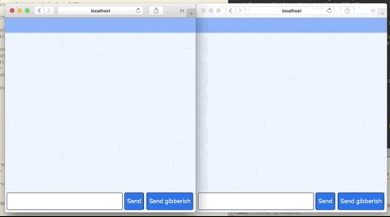

# ts-rpc-chat: Example chat room with ts-rpc

[](https://circleci.com/gh/aiden/ts-rpc-chat/tree/master) [](https://aleen42.github.io/badges/src/typescript.svg) [](https://opensource.org/licenses/MIT) [](https://github.com/prettier/prettier)

This is an example of how to use [ts-rpc](https://github.com/aiden/ts-rpc) and [Redux](https://redux.js.org/) to build real-time apps. It is also a set of best practices.

[](https://github.com/aiden/ts-rpc-chat)

## Usage

```bash
git clone https://github.com/aiden/ts-rpc-chat.git
cd ts-rpc-chat
yarn

# To start the backend server
yarn back

# To start the frontend using webpack-dev-server
yarn web
```

## License

`ts-rpc-chat` is licensed under the MIT License.
